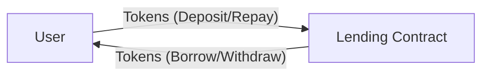
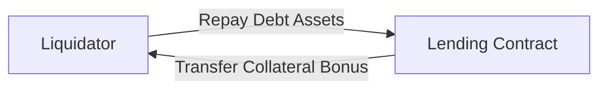
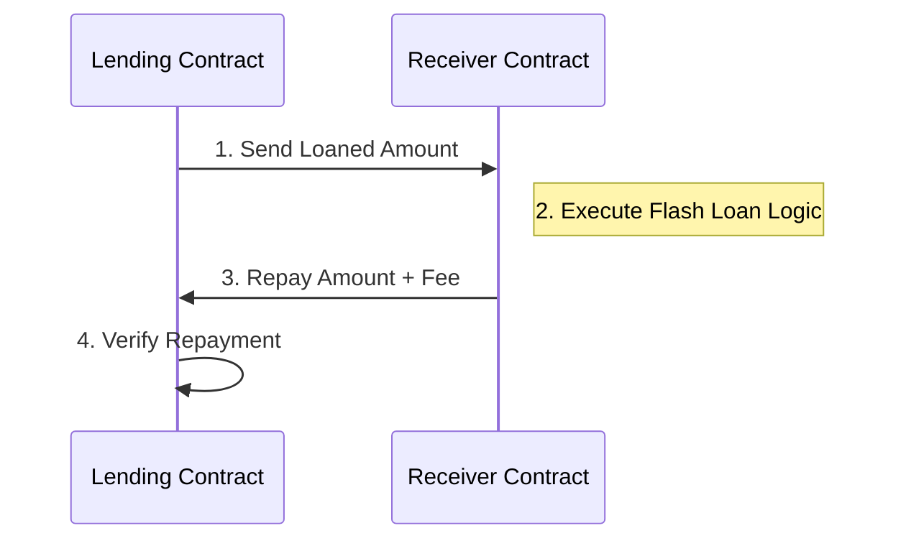

# StellarLend Lending Contract

A secure, efficient lending protocol built on Soroban that allows users to borrow assets against collateral with built-in risk management, flash loans, and governance.

## Features

- **Collateralized Borrowing**: Borrow assets by providing collateral with configurable liquidation thresholds.
- **Interest Accrual**: Automatic interest calculation based on protocol parameters.
- **Risk Management**: Protocol-level debt ceilings, deposit caps, and liquidation incentives.
- **Flash Loans**: Zero-collateral, single-transaction loans with configurable fees.
- **Granular Pausing**: Ability to pause specific operations (Deposit, Borrow, Repay, Withdraw, Liquidation) or the entire protocol.
- **Emergency Lifecycle**: `Normal -> Shutdown -> Recovery -> Normal` flow for handling catastrophic events.
- **Multi-sig Governance**: Secure upgrade mechanism requiring multiple approvals.
- **Persistent Data Store**: Versatile storage system with backup/restore and migration capabilities.
- **Arithmetic Safety**: Protection against overflow/underflow using checked arithmetic.

## Building

```bash
cargo build --target wasm32-unknown-unknown --release
```

## Testing

```bash
cargo test
```

## Contract Interface

### User Operations
- `deposit(env, user, asset, amount)` - Deposit assets into the protocol.
- `borrow(env, user, asset, amount, collateral_asset, collateral_amount)` - Borrow assets against deposited collateral.
- `repay(env, user, asset, amount)` - Repay borrowed assets including accrued interest.
- `withdraw(env, user, asset, amount)` - Withdraw collateral from the protocol.
- `liquidate(env, liquidator, borrower, debt_asset, collateral_asset, amount)` - Liquidate under-collateralized positions.
- `flash_loan(env, receiver, asset, amount, params)` - Execute a flash loan.
- `deposit_collateral(env, user, asset, amount)` - Add collateral to an existing borrow position.

### View Functions
- `get_user_position(env, user)` - Returns full position summary (balances, values, health factor).
- `get_health_factor(env, user)` - Returns current health factor (scaled 10000 = 1.0).
- `get_collateral_value(env, user)` - Returns total collateral value in common units (e.g., USD).
- `get_debt_value(env, user)` - Returns total debt value in common units.
- `get_max_liquidatable_amount(env, user)` - Returns maximum debt that can be liquidated in one call.
- `get_liquidation_incentive_amount(env, repay_amount)` - Returns bonus collateral for liquidators.
- `get_emergency_state(env)` - Returns current lifecycle state (`Normal`, `Shutdown`, `Recovery`).
- `get_performance_stats(env)` - Returns gas/performance stats for the transaction.

### Admin & Risk Control
- `initialize(env, admin, debt_ceiling, min_borrow_amount)` - Initial protocol setup.
- `set_oracle(env, admin, oracle)` - Configure price feed source.
- `set_pause(env, admin, pause_type, paused)` - Toggles granular or global pause state.
- `set_guardian(env, admin, guardian)` - Configure emergency guardian authorized for shutdown.
- `set_liquidation_threshold_bps(env, admin, bps)` - Set threshold for liquidations (e.g., 80%).
- `set_close_factor_bps(env, admin, bps)` - Set max fraction liquidatable per call.
- `emergency_shutdown(env, caller)` - Trigger hard protocol stop (Admin or Guardian).
- `start_recovery(env, admin)` - Transition from Shutdown to Recovery mode.
- `complete_recovery(env, admin)` - Return protocol to Normal operation from Recovery.

### Governance (Upgrades)
- `upgrade_init(env, admin, wasm_hash, threshold)` - Initialize upgrade manager.
- `upgrade_propose(env, caller, wasm_hash, version)` - Propose a new contract version.
- `upgrade_approve(env, caller, proposal_id)` - Approve a pending upgrade proposal.
- `upgrade_execute(env, caller, proposal_id)` - Apply the approved upgrade.

### Data Store Management
- `data_store_init(env, admin)` - Initialize the persistent storage manager.
- `data_save(env, caller, key, value)` - Persist arbitrary data (authorized writers only).
- `data_load(env, key)` - Retrieve data by key.
- `data_backup(env, caller, name)` - Create a snapshot of current storage.
- `data_restore(env, caller, name)` - Restore storage from a named snapshot.

## Token Transfer Flows

### Standard Operations (Deposit, Repay, Borrow, Withdraw)


### Liquidation Flow


### Flash Loan Flow


## Security & Trust Boundaries

### Authorization & Access Control
- **Multisig Admin**: Critical operations (risk parameters, pauses, upgrades) require Admin authorization, ideally a multisig or DAO.
- **Guardian**: A secondary role authorized *only* to trigger `emergency_shutdown`.
- **User Verification**: All user actions (`borrow`, `repay`, etc.) strictly enforce `require_auth()` for the actor.

### Execution Safety
- **Reentrancy**: Flash loans utilize a callback pattern; the protocol state is validated before and after the external call to prevent reentrancy attacks.
- **Arithmetic Integrity**: Every calculation uses checked methods to prevent overflows/underflows. Boundary checks are enforced on all risk parameters.
- **Isolation**: User positions and protocol settings are stored in distinct namespaces to prevent data cross-contamination.

## Documentation

Comprehensive guides are available for specific components:
- [Borrow & Interest](./borrow.md): Detailed logic for borrowing and collateral.
- [Pause & Emergency](./pause.md): How the pause and emergency states work.
- [Emergency Shutdown](./emergency_shutdown.md): Procedures for protocol shutdown.
- [Flash Loans](./flash_loan.md): Technical details on flash loan execution.
- [Views & Monitoring](./views.md): Data structures for frontend integration.
- [Token Receiver](./token_receiver.md): Documentation for the `receive` hook.

## License

See repository root for license information.
